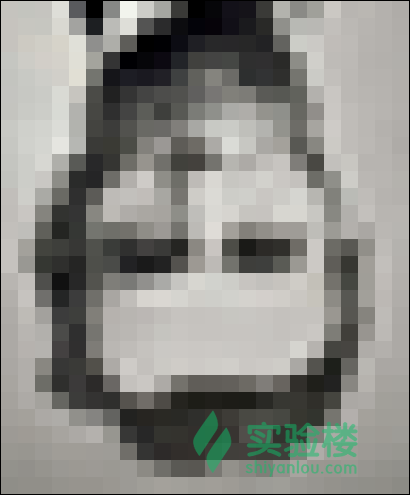
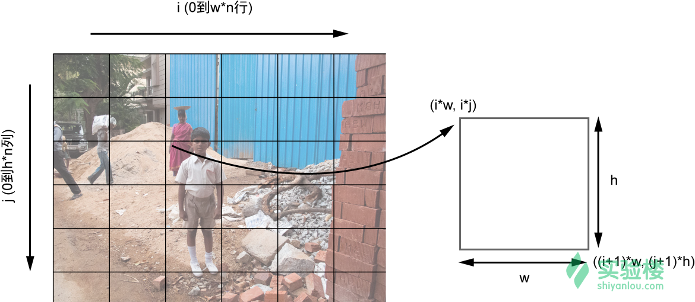

# 使用 Python 创建照片马赛克
## 一、实验介绍



上图是一张照片马赛克，它被分割成长方形的网格，每个长方形中是另一幅图像（最终希望出现在照片马赛克中的图像）替代。换言之，如果从远处看照片马赛克，会看到目标图像；但如果走进，会看到该图像实际上包含许多较小的图像。

### 1.1 实验内容
本课程中，我们将学习如何使用 Python 创建照片马赛克。我们将目标图像划分成较小图像的网格，并用适当的图像替换网格中的每一小块，创建原始图像的照片马赛克。你可以指定网格的尺寸，并选择输入图像是否可以在马赛克中重复使用。

### 1.2 实验来源
本实验源自 异步社区 的 《Python极客项目编程》 第七章，感谢 异步社区 授权实验楼发布。如需系统的学习本书，请购买 《Python极客项目编程》

为了保证可以在实验楼环境中完成本次实验，我们在原书的内容基础上补充了一系列的实验指导，比如实验截图，代码注释，帮助您更好的实战。

如果您对于实验有疑惑或者建议，可以随时在讨论区提问，和同学们一起探讨。

### 1.3 实验知识点
- 用 Python 图像库（PIL）创建图像；
- 计算图像的平均 RGB 值；
- 剪切图像；
- 通过粘贴另一张图像来替代原图像的一部分；
- 利用平均距离测量来比较 RGB 值。
## 二、实验原理
要创建照片马赛克，就从目标图像的块状低分辨率开始（因为在高分辨率的图像中，小块图像的数量会太大）。该图像的分辨率将决定马赛克的维度 M*NM∗N（M 是行数，N 是列数）。接着，根据这种方法替换原始图像中的每一小块：

1. 读入一些小块图像，他们将取代原始图像中的小块；
2. 读入目标图像，将他们分割成 M*NM∗N 的小块网格；
3. 对于目标图像中的每个小块，从输入的小块图像中找到最佳匹配；
4. 将选择的输入图像安排在 M*NM∗N 的网格中，创建最终的照片马赛克。
### 2.1 分割目标图像
按照下图中的方案，开始将目标图像划分成M*N的网格。


上图中的图像展示了如何将原始图像分割成小块的网格。x 轴表示网格的列，y 轴表示网格的行。

**注意，上图中 i 和 j 的取值范围应该分别是“0到n列”和“0到m行”。**

现在，看看如何计算网格中一个小块的坐标。下标为 (i,j)(i,j) 的小块，左上角坐标为(i*w,i*j)(i∗w,i∗j)，右下角坐标为 ((i+1)*w,(j+1)*h)((i+1)∗w,(j+1)∗h)，其中 ww 和 hh 分别是小块的宽度和高度，PIL 可以利用这些数据，从原图像创建小块。
### 2.2 平均颜色值
图像中的每个像素都有颜色，由它的红、绿、蓝值来表示。在这个例子中，使用 8 位的图像，因此每个部分都有 8 位值，范围在 [0,255]。如果一副图像共有 N 个像素，平均 RGB 计算如下：


请注意，平均 RGB 也是一个三元组，不是标量或一个数字，因为平均值是针对每个颜色成分分别计算的。计算平均 RGB 是为了匹配图像小块和目标图像。
### 2.3 匹配图像
对于目标图像中的每个小块，需要在用户指定的输入文件夹下的图像中找到一幅匹配的图像。要确定两个图像是否匹配，可以通过比较平均 RGB 值，最匹配的图像就是平均 RGB 值最接近的图像。要做到这一点，最简单的方法是计算一个像素中 RGB 值之间的距离，以便从输入图像中找到最佳匹配。对于几何中的三维点，可以用以下的距离计算方法：


这里计算了点(r1, g1, b1)和(r2, g2, b2)之间的距离。给定一个目标图像的平均 RGB 值，以及来自输入图像的平均 RGB 值列表，你可以使用线性搜索和三维点距离的计算，来找到最匹配的图像。
## 三、项目文件结构
本实验包括一个 .py 文件和若干图片组成，所有的图片都放置在data 文件夹下，data/a.jpg 是目标图像，data/set1/ 文件夹下存放的是小块图像。
## 四、实验步骤
### 4.1 读入小块图像
首先，从给定的文件夹中读取小块图像：
```python
def getImages(imageDir):
    """
    从给定目录里加载所有替换图像

    @param {str} imageDir 目录路径
    @return {List[Image]} 替换图像列表
    """

    files = os.listdir(imageDir)
    images = []
    for file in files:
        # 得到文件绝对路径
        filePath = os.path.abspath(os.path.join(imageDir, file))
        try:
            fp = open(filePath, "rb")
            im = Image.open(fp)
            images.append(im)
            # 确定了图像信息，但没有加载全部图像数据，用到时才会
            im.load()
            # 用完关闭文件，防止资源泄露
            fp.close()
        except:
            # 加载某个图像识别，直接跳过
            print("Invalid image: %s" % (filePath,))
    return images
```
首先调用 os.listdir() 将 imageDir 目录中的文件放入一个列表。接下来，迭代遍历列表中的每个文件，将它载入为一个 PIL Image 对象。

然后 os.path.abspath() 和 os.path.join() 来获取图像的完整文件名。这个习惯用法在 Python 中经常使用，以确保代码既能在相对路径下工作（如 foo\bar)，也能在绝对路径下工作，并且能跨操作系统，不同的操作系统有不同的目录命名惯例（Windows 用 \ 而 Linux 用 /)。

要将文件加载为 PIL 的 Image 对象，可以将每个文件名传入 Image.open() 方法，但如果照片马赛克文件夹中有几百张甚至几千张图片，这样做非常消耗系统资源。作为替代，可以用 Python 分别打开每个小块图像，利用 Image.open() 将文件句柄 fp 传入 PIL。图像加载完成后，立即关闭文件句柄释放系统资源。

所以先用 open() 打开图像文件，随后将文件句柄传入 Image.open()，将得到的图像对象 im 存入到一个列表，因为 open() 是一个惰性操作，所以接下来需要强制调用 Image.load()，强制 im 加载文件中的图像数据。Image.open() 确定了图像，但它实际上没有读取全部图像数据，直到使用该图像时才会那么做。

最后就是使用 fp.close() 关闭文件句柄，释放系统资源。

### 4.2 计算输入图像的平均颜色值
读入输入图像后，需要计算它们的平均颜色值，以及目标图像中的每个小块的值。创建一个方法 getAcerageRGB() 来计算这两个值。
```python
def getAverageRGB(image):
    """
    计算图像的平均 RGB 值

    将图像包含的每个像素点的 R、G、B 值分别累加，然后除以像素点数，就得到图像的平均 R、G、B
    值

    @param {Image} image PIL Image 对象
    @return {Tuple[int, int, int]} 平均 RGB 值
    """

    # 计算像素点数
    npixels = image.size[0] * image.size[1]
    # 获得图像包含的每种颜色及其计数，结果类似
    # [(c1, (r1, g1, b1)), (c2, (r2, g2, b2)), ...]
    cols = image.getcolors(npixels)
    # 获得每种颜色的 R、G、B 累加值，结果类似
    # [(c1 * r1, c1 * g1, c1 * b1), (c2 * r2, c2 * g2, c2 * b2), ...]
    sumRGB = [(x[0] * x[1][0], x[0] * x[1][1], x[0] * x[1][2]) for x in cols]
    # 先用 zip 方法对 sumRGB 列表里的元组对象按列进行合并，结果类似
    # [(c1 * r1, c2 * r2, ...), (c1 * g1, c2 * g2, ...),
    # (c1 * b1, c2 * b2, ...)]
    # 然后计算所有颜色的 R、G、B 平均值，算法为
    # (sum(ci * ri) / np, sum(ci * gi) / np, sum(ci * bi) / np)
    avg = tuple([int(sum(x) / npixels) for x in zip(*sumRGB)])
    return avg
```
首先得到图像中包含的每种颜色及其计数，然后累加得到每种颜色的累加值，最后将所有不同颜色的累加值汇总后求平均即可。

### 4.3 将目标图像分割成网格
现在，需要将目标图像分割成 M*NM∗N 网格，包含更小的图像。让我们创建一个方法来实现。
```python
def splitImage(image, size):
    """
    将图像按网格划分成多个小图像

    @param {Image} image PIL Image 对象
    @param {Tuple[int, int]} size 网格的行数和列数
    @return {List[Image]} 小图像列表
    """

    W, H = image.size[0], image.size[1]
    m, n = size
    w, h = int(W / n), int(H / m)
    imgs = []
    # 先按行再按列裁剪出 m * n 个小图像
    for j in range(m):
        for i in range(n):
            # 坐标原点在图像左上角
            imgs.append(image.crop((i * w, j * h, (i + 1) * w, (j + 1) * h)))
    return imgs
```
首先，W,H=image.size[0],image.size[1] 得到目标图像的维度，然后 m,n=size 得到尺寸。接下来，w,h=int(W/n),int(H/m) 计算目标图像中每一小块的尺寸。

计算出小块的尺寸后，就可以根据网格的维度进行迭代遍历，分割并将每一小块保存为单独的图像。最后 image.crop() 利用左上角图像坐标和裁剪图像的维度作为参数，裁剪出图像的一部分（见 2.1 小节）。

### 4.4 寻找小块的最佳匹配
现在，让我们从输入图像的文件夹中，找到小块的最佳匹配。创建一个工具方法 getBestMatchIndex()，如下所示：
```python
def getBestMatchIndex(input_avg, avgs):
    """
    找出颜色值最接近的索引

    把颜色值看做三维空间里的一个点，依次计算目标点跟列表里每个点在三维空间里的距离，从而得到距
    离最近的那个点的索引。

    @param {Tuple[int, int, int]} input_avg 目标颜色值
    @param {List[Tuple[int, int, int]]} avgs 要搜索的颜色值列表
    @return {int} 命中元素的索引
    """

    index = 0
    min_index = 0
    min_dist = float("inf")
    for val in avgs:
        # 三维空间两点距离计算公式 (x1 - x2) * (x1 - x2) + (y1 - y2) * (y1 - y2)
        # + (z1 - z2) * (z1 - z2)，这里只需要比较大小，所以无需求平方根值
        dist = ((val[0] - input_avg[0]) * (val[0] - input_avg[0]) +
                (val[1] - input_avg[1]) * (val[1] - input_avg[1]) +
                (val[2] - input_avg[2]) * (val[2] - input_avg[2]))
        if dist < min_dist:
            min_dist = dist
            min_index = index
        index += 1

    return min_index
```
需要从列表 avgs 中，找到最匹配平均 RGB 值 input_avg 的。avgs 是小块图像平均 RGB 值的列表。

为了找到最佳匹配，比较这些输入图像的平均 RGB 值，min_index = 0, min_dist = float("inf")，将最接近的匹配下标初始化为 0，最小距离初始化为无穷大。该测试在第一次总是会通过，因为任何距离都小于无穷大。接下来，遍历平均值列表中的值，依次计算与 input_avg 的距离（比较距离的平方，以减少计算时间）。如果新的距离比原有的距离要小，就使用新的纪录替代原有的数据。迭代结束后，就得到了平均 RGB 值列表 avgs 中，最接近 input_avg 的下标。现在可以利用这个下标，从小块图像的列表中选择匹配的小块图像了。

### 4.5 创建图像网格
在创建照片马赛克之前，还需要一个工具方法：createImageGrid()。这个方法将创建大小为 M*NM∗N 的图像网格，往这个网格中填入小块图像，就可以创建出照片马赛克。
```python
def createImageGrid(images, dims):
    """
    将图像列表里的小图像按先行后列的顺序拼接为一个大图像

    @param {List[Image]} images 小图像列表
    @param {Tuple[int, int]} dims 大图像的行数和列数
    @return Image 拼接得到的大图像
    """

    m, n = dims

    # 确保小图像个数满足要求
    assert m * n == len(images)

    # 计算所有小图像的最大宽度和高度
    width = max([img.size[0] for img in images])
    height = max([img.size[1] for img in images])

    # 创建大图像对象
    grid_img = Image.new('RGB', (n * width, m * height))

    # 依次将每个小图像粘贴到大图像里
    for index in range(len(images)):
        # 计算要粘贴到网格的哪行
        row = int(index / n)
        # 计算要粘贴到网格的哪列
        col = index - n * row
        # 根据行列数以及网格的大小得到网格的左上角坐标，把小图像粘贴到这里
        grid_img.paste(images[index], (col * width, row * height))

    return grid_img
```
在创建图像网格之前，需要先用 assert 检查提供给 createImageGrid() 的图像数量是否符合网格的大小（ assert 方法检查代码中的假定，特别是在开发和测试过程中的假定）。现在你有一个小块图像列表，基于最接近的 RGB 值，你将用它来创建一幅图像，表现照片马赛克。由于大小差异，某些选定的图像可能不会正好填充一个小块，但这不会是一个问题，因为你首先用黑色背景填充小块。

width = max([img.size[0] for img in images])和 height = max([img.size[1] for img in images]) 的作用是计算小块图像的最大宽度和高度（你没有对选择的输入图像的大小做出任何假定，无论它们相同或不同，代码都能工作），如果输入图像不能完全填充小块，小块之间的空间将显示为背景色，默认是黑色。

grid_img = Image.new('RGB', (n*width, m*height)) 创建一个空的 Image，大小符合网格中的所有图像。小块图像会粘贴到这个图像，填充图像网格。随后，循环遍历选定的图像，调用 Image.paste() 方法，将它们粘贴到相应的网格中。Image.paste() 的第一个参数是要粘贴的 Image 对象，第二个参数是左上角的坐标。现在，你要搞清楚小块图像要粘贴到图像网格的行和列。为了做到这一点，将图像下标表示为行和列。小块在图像网格中的下标由 N*row+colN∗row+col 给出，其中 NN 是一行的小块数，(row,col)(row,col) 是在该网格中的坐标。行和列的分别由 row=int(index/n) 和 col=index-n*row 给出。

### 4.6 创建照片马赛克
现在，有了所有必需的工具方法，让我们编写一个 main 函数，创建照片马赛克。
```python
def createPhotomosaic(target_image, input_images, grid_size,
                      reuse_images=True):
    """
    图片马赛克生成

    @param {Image} target_image 目标图像
    @param {List[Image]} input_images 替换图像列表
    @param {Tuple[int, int]} grid_size 网格行数和列数
    @param {bool} reuse_images 是否允许重复使用替换图像
    @return {Image} 马赛克图像
    """

    # 将目标图像切成网格小图像
    print('splitting input image...')
    target_images = splitImage(target_image, grid_size)

    # 为每个网格小图像在替换图像列表里找到颜色最相似的替换图像
    print('finding image matches...')
    output_images = []
    # 分 10 组进行，每组完成后打印进度信息，避免用户长时间等待
    count = 0
    batch_size = int(len(target_images) / 10)

    # 计算替换图像列表里每个图像的颜色平均值
    avgs = []
    for img in input_images:
        avgs.append(getAverageRGB(img))

    # 对每个网格小图像，从替换图像列表找到颜色最相似的那个，添加到 output_images 里
    for img in target_images:
        # 计算颜色平均值
        avg = getAverageRGB(img)
        # 找到最匹配的那个小图像，添加到 output_images 里
        match_index = getBestMatchIndex(avg, avgs)
        output_images.append(input_images[match_index])
        # 如果完成了一组，打印进度信息
        if count > 0 and batch_size > 10 and count % batch_size == 0:
            print('processed %d of %d...' % (count, len(target_images)))
        count += 1
        # 如果不允许重用替换图像，则用过后就从列表里移除
        if not reuse_images:
            input_images.remove(match)

    # 将 output_images 里的图像按网格大小拼接成一个大图像
    print('creating mosaic...')
    mosaic_image = createImageGrid(output_images, grid_size)

    return mosaic_image
```
createPhotomosaic() 方法的输入是目标图像，输入图像列表，生成照片马赛克的大小，以及一个表明图像是否可以复用的标志。首先调用 splitImage 将图像分割成一个网格。图像被分割后，针对每个小块，从输入文件夹中寻找匹配的图像（因为这个过程可能很长，所以提供反馈给用以，让他们知道程序仍在工作）。

随后将 batch_size 设置为小块图像总数的十分之一。后面的程序将会依据 batch_size 的大小来向用户更新信息（选择十分之一是任意的，只是一种方式让程序说：“我还活着。”每次处理了图像的十分之一，就打印一条消息，表用程序仍在运行）。

在设置好 batch_size 后，为输入文件夹中的每个图像计算平均 RGB 值，并保存在列表 avgs 中。然后，开始迭代遍历目标图像网格中的每个小块。对于每个小块，avg=getAverage(img) 计算平均 RGB 值。然后，从输入图像的评价值列表中，match_index=getBestMatchIndex(avg,avgs) 寻找该值的最佳匹配。返回结果是一个下标，output_images.append(input_images[match_index]) 取得该下标对应的图像，并保存在列表中。

随后就是创建照片马赛克，由于这个过程相对耗时，所以每处理 batch_size 个图像，就为用户打印一条消息。如果 reuse_images 标志设置为 False，就从列表中删除选定的输入图像，这样就不会再另一个小块中重用（如果有广泛的输入图像可选，这种方式效果最好）。最后 mosaic_image=createImageGrid(output_images,grid_size) 创建最终的照片马赛克。

### 4.7 添加命令行选项
该程序的 main() 方法支持这些命令行选项：
```python
    # 定义程序接收的命令行参数
    parser = argparse.ArgumentParser(
        description='Creates a photomosaic from input images')
    parser.add_argument('--target-image', dest='target_image', required=True)
    parser.add_argument('--input-folder', dest='input_folder', required=True)
    parser.add_argument('--grid-size', nargs=2,
                        dest='grid_size', required=True)
    parser.add_argument('--output-file', dest='outfile', required=False)

    # 解析命令行参数
    args = parser.parse_args()
```
包括三个必需的命令行参数：目标图像的名称，输入图像文件夹的名称，以及网格尺寸。第四个参数是可选的文件名，如果省略该文件名，照片将写入文件 mosaic.png 中。

### 4.8 控制照片马赛克的大小
要解决的最后一个问题是照片马赛克的大小，如果基于目标图像中匹配的小块，盲目地将输入图像粘贴在一起，就会得到一个巨大的照片马赛克，比目标图像大得多。为了避免这种情况，调整输入图像的大小，以匹配网格中每个小块的大小（这样做还有一个好处，可以加快平均 RGB 的计算，因为用了较小的图像）。

main() 方法也进行这样的处理：
```python
    # 将所有替换图像缩放到指定的网格大小
    print('resizing images...')
    dims = (int(target_image.size[0] / grid_size[1]),
            int(target_image.size[1] / grid_size[0]))
    for img in input_images:
        img.thumbnail(dims)
```
### 4.9 完整代码
```python
"""
使用 Python 创建照片马赛克

输入一张目标照片和多张替换照片，将目标照片按网格划分为许多小方块，然后将每个小方块替换为颜色值最
接近的那张替换照片，就形成了马赛克效果。
"""

import argparse
import os

import numpy as np
from PIL import Image


def splitImage(image, size):
    """
    将图像按网格划分成多个小图像

    @param {Image} image PIL Image 对象
    @param {Tuple[int, int]} size 网格的行数和列数
    @return {List[Image]} 小图像列表
    """

    W, H = image.size[0], image.size[1]
    m, n = size
    w, h = int(W / n), int(H / m)
    imgs = []
    # 先按行再按列裁剪出 m * n 个小图像
    for j in range(m):
        for i in range(n):
            # 坐标原点在图像左上角
            imgs.append(image.crop((i * w, j * h, (i + 1) * w, (j + 1) * h)))
    return imgs


def getImages(imageDir):
    """
    从给定目录里加载所有替换图像

    @param {str} imageDir 目录路径
    @return {List[Image]} 替换图像列表
    """

    files = os.listdir(imageDir)
    images = []
    for file in files:
        # 得到文件绝对路径
        filePath = os.path.abspath(os.path.join(imageDir, file))
        try:
            fp = open(filePath, "rb")
            im = Image.open(fp)
            images.append(im)
            # 确定了图像信息，但没有加载全部图像数据，用到时才会
            im.load()
            # 用完关闭文件，防止资源泄露
            fp.close()
        except:
            # 加载某个图像识别，直接跳过
            print("Invalid image: %s" % (filePath,))
    return images


def getAverageRGB(image):
    """
    计算图像的平均 RGB 值

    将图像包含的每个像素点的 R、G、B 值分别累加，然后除以像素点数，就得到图像的平均 R、G、B
    值

    @param {Image} image PIL Image 对象
    @return {Tuple[int, int, int]} 平均 RGB 值
    """

    # 计算像素点数
    npixels = image.size[0] * image.size[1]
    # 获得图像包含的每种颜色及其计数，结果类似 [(cnt1, (r1, g1, b1)), ...]
    cols = image.getcolors(npixels)
    # 获得每种颜色的 R、G、B 累加值，结果类似 [(c1 * r1, c1 * g1, c1 * g2), ...]
    sumRGB = [(x[0] * x[1][0], x[0] * x[1][1], x[0] * x[1][2]) for x in cols]
    # 分别计算所有颜色的 R、G、B 平均值，算法类似(sum(ci * ri)/np, sum(ci * gi)/np,
    # sum(ci * bi)/np)
    # zip 的结果类似[(c1 * r1, c2 * r2, ..), (c1 * g1, c1 * g2, ...), (c1 * b1,
    # c1 * b2, ...)]
    avg = tuple([int(sum(x) / npixels) for x in zip(*sumRGB)])
    return avg


def getAverageRGBNumpy(image):
    """
    计算图像的平均 RGB 值，使用 numpy 来计算以提升性能

    @param {Image} image PIL Image 对象
    @return {Tuple[int, int, int]} 平均 RGB 值
    """

    # 将 PIL Image 对象转换为 numpy 数据数组
    im = np.array(image)
    # 获得图像的宽、高和深度
    w, h, d = im.shape
    # 将数据数组变形并计算平均值
    return tuple(np.average(im.reshape(w * h, d), axis=0))


def getBestMatchIndex(input_avg, avgs):
    """
    找出颜色值最接近的索引

    把颜色值看做三维空间里的一个点，依次计算目标点跟列表里每个点在三维空间里的距离，从而得到距
    离最近的那个点的索引。

    @param {Tuple[int, int, int]} input_avg 目标颜色值
    @param {List[Tuple[int, int, int]]} avgs 要搜索的颜色值列表
    @return {int} 命中元素的索引
    """

    index = 0
    min_index = 0
    min_dist = float("inf")
    for val in avgs:
        # 三维空间两点距离计算公式 (x1 - x2) * (x1 - x2) + (y1 - y2) * (y1 - y2)
        # + (z1 - z2) * (z1 - z2)，这里只需要比较大小，所以无需求平方根值
        dist = ((val[0] - input_avg[0]) * (val[0] - input_avg[0]) +
                (val[1] - input_avg[1]) * (val[1] - input_avg[1]) +
                (val[2] - input_avg[2]) * (val[2] - input_avg[2]))
        if dist < min_dist:
            min_dist = dist
            min_index = index
        index += 1

    return min_index


def createImageGrid(images, dims):
    """
    将图像列表里的小图像按先行后列的顺序拼接为一个大图像

    @param {List[Image]} images 小图像列表
    @param {Tuple[int, int]} dims 大图像的行数和列数
    @return Image 拼接得到的大图像
    """

    m, n = dims

    # 确保小图像个数满足要求
    assert m * n == len(images)

    # 计算所有小图像的最大宽度和高度
    width = max([img.size[0] for img in images])
    height = max([img.size[1] for img in images])

    # 创建大图像对象
    grid_img = Image.new('RGB', (n * width, m * height))

    # 依次将每个小图像粘贴到大图像里
    for index in range(len(images)):
        # 计算要粘贴到网格的哪行
        row = int(index / n)
        # 计算要粘贴到网格的哪列
        col = index - n * row
        # 根据行列数以及网格的大小得到网格的左上角坐标，把小图像粘贴到这里
        grid_img.paste(images[index], (col * width, row * height))

    return grid_img


def createPhotomosaic(target_image, input_images, grid_size,
                      reuse_images=True):
    """
    图片马赛克生成

    @param {Image} target_image 目标图像
    @param {List[Image]} input_images 替换图像列表
    @param {Tuple[int, int]} grid_size 网格行数和列数
    @param {bool} reuse_images 是否允许重复使用替换图像
    @return {Image} 马赛克图像
    """

    # 将目标图像切成网格小图像
    print('splitting input image...')
    target_images = splitImage(target_image, grid_size)

    # 为每个网格小图像在替换图像列表里找到颜色最相似的替换图像
    print('finding image matches...')
    output_images = []
    # 分 10 组进行，每组完成后打印进度信息，避免用户长时间等待
    count = 0
    batch_size = int(len(target_images) / 10)

    # 计算替换图像列表里每个图像的颜色平均值
    avgs = []
    for img in input_images:
        avgs.append(getAverageRGB(img))

    # 对每个网格小图像，从替换图像列表找到颜色最相似的那个，添加到 output_images 里
    for img in target_images:
        # 计算颜色平均值
        avg = getAverageRGB(img)
        # 找到最匹配的那个小图像，添加到 output_images 里
        match_index = getBestMatchIndex(avg, avgs)
        output_images.append(input_images[match_index])
        # 如果完成了一组，打印进度信息
        if count > 0 and batch_size > 10 and count % batch_size == 0:
            print('processed %d of %d...' % (count, len(target_images)))
        count += 1
        # 如果不允许重用替换图像，则用过后就从列表里移除
        if not reuse_images:
            input_images.remove(match)

    # 将 output_images 里的图像按网格大小拼接成一个大图像
    print('creating mosaic...')
    mosaic_image = createImageGrid(output_images, grid_size)

    return mosaic_image


def main():
    # 定义程序接收的命令行参数
    parser = argparse.ArgumentParser(
        description='Creates a photomosaic from input images')
    parser.add_argument('--target-image', dest='target_image', required=True)
    parser.add_argument('--input-folder', dest='input_folder', required=True)
    parser.add_argument('--grid-size', nargs=2,
                        dest='grid_size', required=True)
    parser.add_argument('--output-file', dest='outfile', required=False)

    # 解析命令行参数
    args = parser.parse_args()

    # 网格大小
    grid_size = (int(args.grid_size[0]), int(args.grid_size[1]))

    # 马赛克图像保存路径，默认为 mosaic.png
    output_filename = 'mosaic.png'
    if args.outfile:
        output_filename = args.outfile

    # 打开目标图像
    print('reading targe image...')
    target_image = Image.open(args.target_image)

    # 从指定文件夹下加载所有替换图像
    print('reading input images...')
    input_images = getImages(args.input_folder)
    # 如果替换图像列表为空则退出程序
    if input_images == []:
        print('No input images found in %s. Exiting.' % (args.input_folder, ))
        exit()

    # 将所有替换图像缩放到指定的网格大小
    print('resizing images...')
    dims = (int(target_image.size[0] / grid_size[1]),
            int(target_image.size[1] / grid_size[0]))
    for img in input_images:
        img.thumbnail(dims)

    # 生成马赛克图像
    print('starting photomosaic creation...')
    mosaic_image = createPhotomosaic(target_image, input_images, grid_size)

    # 保存马赛克图像
    mosaic_image.save(output_filename, 'PNG')
    print("saved output to %s" % (output_filename,))

    print('done.')


if __name__ == '__main__':
    main()
```
### 4.10 运行照片马赛克程序
在 data 的父文件夹下执行命令：
```python
$ python photomosaic.py --target-image data/a.jpg --input-folder data/set1/ --grid-size 128 128
reading input folder...
starting photomosaic creation...
resizing images...
max tile dims: (14, 10)
splitting input image...
finding image matches...
processed 1638 of 16384...
processed 3276 of 16384...
processed 4914 of 16384...
processed 6552 of 16384...
processed 8190 of 16384...
processed 9828 of 16384...
processed 11466 of 16384...
processed 13104 of 16384...
processed 14742 of 16384...
processed 16380 of 16384...
creating mosaic...
saved output to mosaic.png
done.
```
原图


结果


## 五、课后练习
编写一个程序，创建图像的块状版本，类似实验中出现的第一张图片。

利用本章的代码，通过粘贴匹配的图像创建照片马赛克，小块图像之间没有间隙。更艺术的表现形式，是在每个小块图像之间流出几个像素的均匀间隙。如何创建这样的间隙（提示：在计算最终的图像尺寸以及在 createImageGrid() 中粘贴时，考虑间隙的因素）？

程序的大部分时间，用于从输入文件夹中寻找小块图像的最佳匹配。为了加快程序， getBestMatchIndex() 需要运行得更快。这儿方法是对平均值（看成三维的点）列表进行简单的线性搜索。这个任务的一般问题就是最近邻居搜索。找到最近点有一种特别有效的方法，即 K-D 树搜索。 SciPy 库有一个方便的类 scipy.spatial.KDTree，可以创建 K-D 并向它查询最近点的匹配。请尝试用 SciPy 的 K-D 树替代线性搜索（参见http://docs.scipy.org/doc/scipy/reference/generated/ scipy.spatial.KDTree.html)
